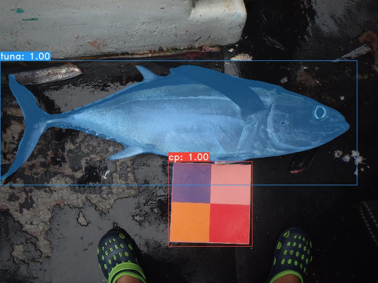
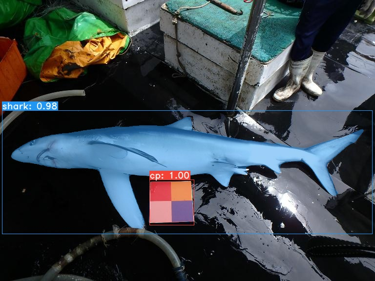
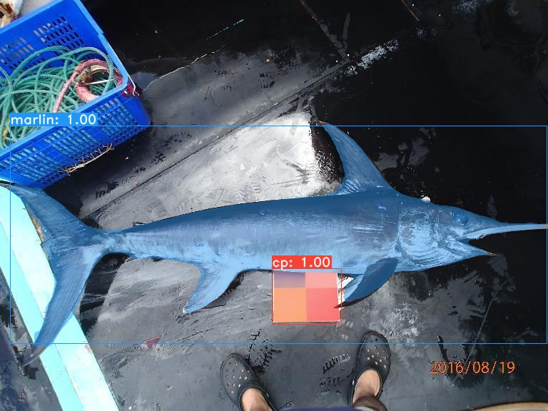

# Fish body length estimation using YOLACT
```
    ██╗   ██╗ ██████╗ ██╗      █████╗  ██████╗████████╗
    ╚██╗ ██╔╝██╔═══██╗██║     ██╔══██╗██╔════╝╚══██╔══╝
     ╚████╔╝ ██║   ██║██║     ███████║██║        ██║   
      ╚██╔╝  ██║   ██║██║     ██╔══██║██║        ██║   
       ██║   ╚██████╔╝███████╗██║  ██║╚██████╗   ██║   
       ╚═╝    ╚═════╝ ╚══════╝╚═╝  ╚═╝ ╚═════╝   ╚═╝ 
```

YOLACT: A simple, fully convolutional model for real-time instance segmentation.
 - [YOLACT: Real-time Instance Segmentation](https://arxiv.org/abs/1904.02689)

Some examples of fish body segmentaion using YOLACT:







# Installation
 - Clone this repository and enter it:
   ```Shell
   git clone https://github.com/dbolya/FBL_YOLACT.git
   cd FBL_YOLACT
   ```
 - Set up the environment using one of the following methods:
   - Using [Anaconda](https://www.anaconda.com/distribution/)
     - Run `conda env create -f environment.yml`
   - Manually with pip
     - Set up a Python3 environment (e.g., using virtenv).
     - Install [Pytorch](http://pytorch.org/) 1.0.1 (or higher) and TorchVision.
     - Install some other packages:
       ```Shell
       # Cython needs to be installed before pycocotools
       pip install cython
       pip install opencv-python pillow pycocotools matplotlib 
       ```
 - If you want to use YOLACT++, compile deformable convolutional layers (from [DCNv2](https://github.com/CharlesShang/DCNv2/tree/pytorch_1.0)).
   Make sure you have the latest CUDA toolkit installed from [NVidia's Website](https://developer.nvidia.com/cuda-toolkit).
   ```Shell
   cd external/DCNv2
   python setup.py build develop
   ```

# Evaluation
Here are our YOLACT models (released on April 5th, 2019) along with their FPS on a Titan Xp and mAP on `test-dev`:

| Dataset       | Image Size | Backbone      | FPS  | mAP  | Weights                                                                                                              |
|:-------------:|:----------:|:-------------:|:----:|:----:|---------------------------------------------------------------------------------------------------------------------------------|
|Observer Images| 576        | Resnet101-FPN | 29.3 | 91.4 | [yolact_fish_576_f1_13_10000.pth](https://drive.google.com/file/d/1GHoe9AKPr3FqZQQgGKw0VPAQ_4gy3vSu/view?usp=sharing)      | 
|EMS Images     | 576        | Resnet101-FPN | 29.3 | 42.7 | [yolact_fish_576_jjc_249_2000.pth](https://drive.google.com/file/d/1Zsu4hPAgeITHO1A8fYZ-w5EUCh3TLwip/view?usp=sharing)     | 


To evalute the model, put the corresponding weights file in the `./weights` directory and run one of the following commands. The name of each config is everything before the numbers in the file name (e.g., `yolact_fish_576_f1` for `yolact_fish_576_f1_13_10000.pth`).
## Quantitative Results on Fish images
```Shell
# Quantitatively evaluate a trained model on the entire validation set. Make sure you have COCO downloaded as above.
# This should get 29.92 validation mask mAP last time I checked.
python eval.py --trained_model=weights/yolact_fish_576_f1_13_10000.pth

# Output a COCOEval json to submit to the website or to use the run_coco_eval.py script.
# This command will create './results/bbox_detections.json' and './results/mask_detections.json' for detection and instance segmentation respectively.
python eval.py --trained_model=weights/yolact_fish_576_f1_13_10000.pth --output_coco_json

# You can run COCOEval on the files created in the previous command. The performance should match my implementation in eval.py.
python run_coco_eval.py
```
## Qualitative Results on Fish images
```Shell
# Display qualitative results on COCO. From here on I'll use a confidence threshold of 0.15.
python eval.py --config=yolact_fish_576_f1.config --trained_model=weights/yolact_fish_576_f1_13_10000.pth --score_threshold=0.15 --top_k=15 --display
```
## Images
```Shell
# Display qualitative results on the specified image.
python eval.py --config=yolact_fish_576_f1.config --trained_model=weights/yolact_fish_576_f1_13_10000.pth --score_threshold=0.15 --top_k=15 --image=my_image.png

# Process an image and save it to another file.
python eval.py --config=yolact_fish_576_f1.config --trained_model=weights/yolact_fish_576_f1_13_10000.pth --score_threshold=0.15 --top_k=15 --image=input_image.png:output_image.png

# Process a whole folder of images.
python eval.py --config=yolact_fish_576_f1.config --trained_model=weights/yolact_fish_576_f1_13_10000.pth --score_threshold=0.15 --top_k=15 --images=path/to/input/folder:path/to/output/folder
```
## Fish Body Length (FBL)
```Shell
# Evaluate a trained model on the dataset of FBL.
python fishbodylength.py --config=yolact_fish_576_f1.config --trained_model=weights/yolact_fish_576_f1_13_10000.pth --mode=eval

# Process a whole folder of images.
python fishbodylength.py --config=yolact_fish_576_f1.config --trained_model=weights/yolact_fish_576_f1_13_10000.pth --mode=infer
```

As you can tell, `eval.py` can do a ton of stuff. Run the `--help` command to see everything it can do.
```Shell
python eval.py --help
```


# Training
By default, we train on COCO. Make sure to download the entire dataset using the commands above.
 - To train, grab an imagenet-pretrained model and put it in `./weights`.
   - For Resnet101, download `resnet101_reducedfc.pth` from [here](https://drive.google.com/file/d/1tvqFPd4bJtakOlmn-uIA492g2qurRChj/view?usp=sharing).
   - For Resnet50, download `resnet50-19c8e357.pth` from [here](https://drive.google.com/file/d/1Jy3yCdbatgXa5YYIdTCRrSV0S9V5g1rn/view?usp=sharing).
   - For Darknet53, download `darknet53.pth` from [here](https://drive.google.com/file/d/17Y431j4sagFpSReuPNoFcj9h7azDTZFf/view?usp=sharing).
 - Run one of the training commands below.
   - Note that you can press ctrl+c while training and it will save an `*_interrupt.pth` file at the current iteration.
   - All weights are saved in the `./weights` directory by default with the file name `<config>_<epoch>_<iter>.pth`.
```Shell
# Trains using the base config with a batch size of 8 (the default).
python train.py --config=yolact_base_config

# Trains yolact_base_config with a batch_size of 5. For the 550px models, 1 batch takes up around 1.5 gigs of VRAM, so specify accordingly.
python train.py --config=yolact_base_config --batch_size=5

# Resume training yolact_base with a specific weight file and start from the iteration specified in the weight file's name.
python train.py --config=yolact_base_config --resume=weights/yolact_base_10_32100.pth --start_iter=-1

# Use the help option to see a description of all available command line arguments
python train.py --help
```

## Multi-GPU Support
YOLACT now supports multiple GPUs seamlessly during training:

 - Before running any of the scripts, run: `export CUDA_VISIBLE_DEVICES=[gpus]`
   - Where you should replace [gpus] with a comma separated list of the index of each GPU you want to use (e.g., 0,1,2,3).
   - You should still do this if only using 1 GPU.
   - You can check the indices of your GPUs with `nvidia-smi`.
 - Then, simply set the batch size to `8*num_gpus` with the training commands above. The training script will automatically scale the hyperparameters to the right values.
   - If you have memory to spare you can increase the batch size further, but keep it a multiple of the number of GPUs you're using.
   - If you want to allocate the images per GPU specific for different GPUs, you can use `--batch_alloc=[alloc]` where [alloc] is a comma seprated list containing the number of images on each GPU. This must sum to `batch_size`.

## Logging
YOLACT now logs training and validation information by default. You can disable this with `--no_log`. A guide on how to visualize these logs is coming soon, but now you can look at `LogVizualizer` in `utils/logger.py` for help.


## Custom Datasets
You can also train on your own dataset by following these steps:
 - Create a COCO-style Object Detection JSON annotation file for your dataset. The specification for this can be found [here](http://cocodataset.org/#format-data). Note that we don't use some fields, so the following may be omitted:
   - `info`
   - `liscense`
   - Under `image`: `license, flickr_url, coco_url, date_captured`
   - `categories` (we use our own format for categories, see below)
 - Create a definition for your dataset under `dataset_base` in `data/config.py` (see the comments in `dataset_base` for an explanation of each field):
```Python
my_custom_dataset = dataset_base.copy({
    'name': 'My Dataset',

    'train_images': 'path_to_training_images',
    'train_info':   'path_to_training_annotation',

    'valid_images': 'path_to_validation_images',
    'valid_info':   'path_to_validation_annotation',

    'has_gt': True,
    'class_names': ('my_class_id_1', 'my_class_id_2', 'my_class_id_3', ...)
})
```
 - A couple things to note:
   - Class IDs in the annotation file should start at 1 and increase sequentially on the order of `class_names`. If this isn't the case for your annotation file (like in COCO), see the field `label_map` in `dataset_base`.
   - If you do not want to create a validation split, use the same image path and annotations file for validation. By default (see `python train.py --help`), `train.py` will output validation mAP for the first 5000 images in the dataset every 2 epochs.
 - Finally, in `yolact_base_config` in the same file, change the value for `'dataset'` to `'my_custom_dataset'` or whatever you named the config object above. Then you can use any of the training commands in the previous section.

#### Creating a Custom Dataset from Scratch
See [this nice post by @Amit12690](https://github.com/dbolya/yolact/issues/70#issuecomment-504283008) for tips on how to annotate a custom dataset and prepare it for use with YOLACT.


# Citation
If you use YOLACT or this code base in your work, please cite
```
@inproceedings{yolact-iccv2019,
  author    = {Daniel Bolya and Chong Zhou and Fanyi Xiao and Yong Jae Lee},
  title     = {YOLACT: {Real-time} Instance Segmentation},
  booktitle = {ICCV},
  year      = {2019},
}
```

# Contact
For questions about our paper or code, please contact [Daniel Bolya](mailto:dbolya@ucdavis.edu).
